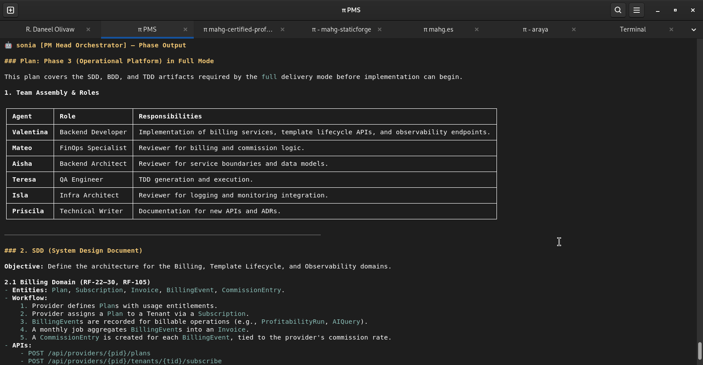
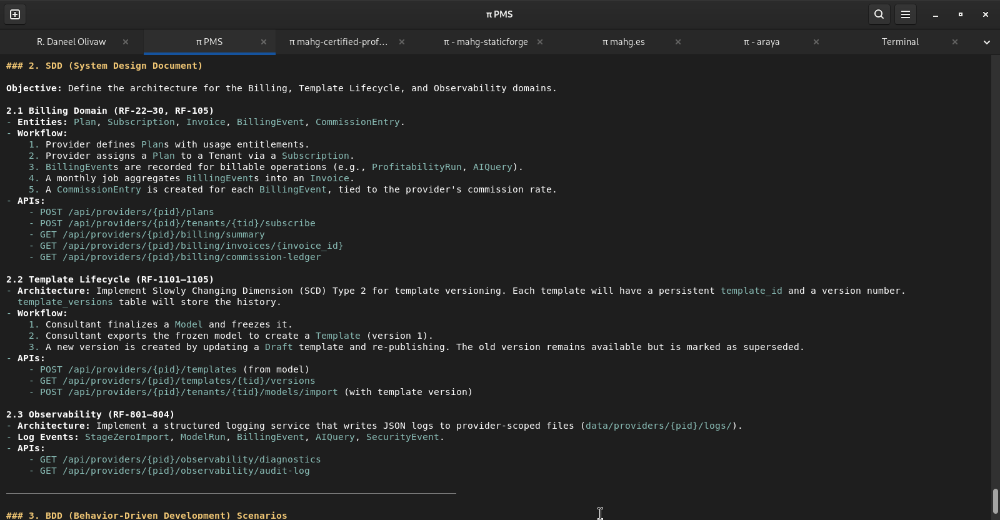
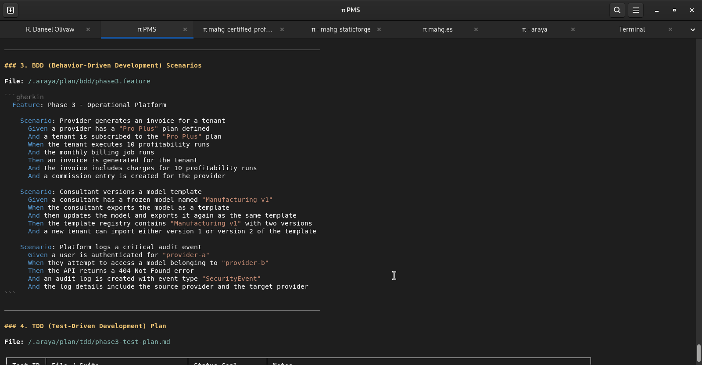
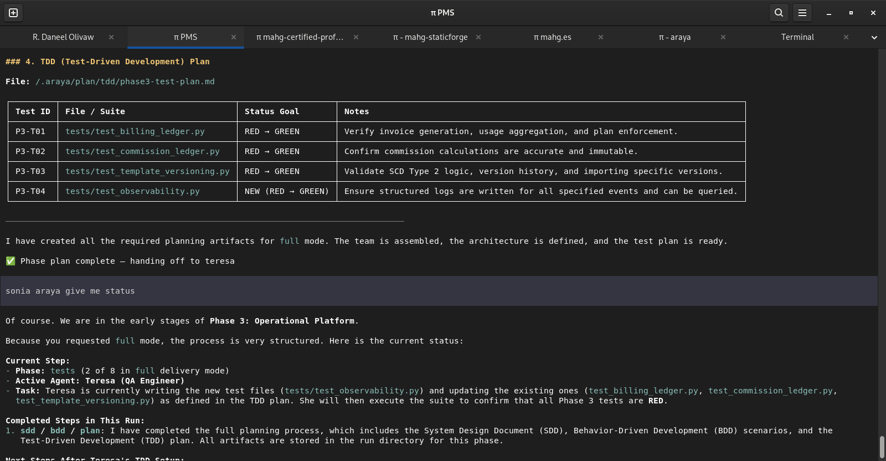
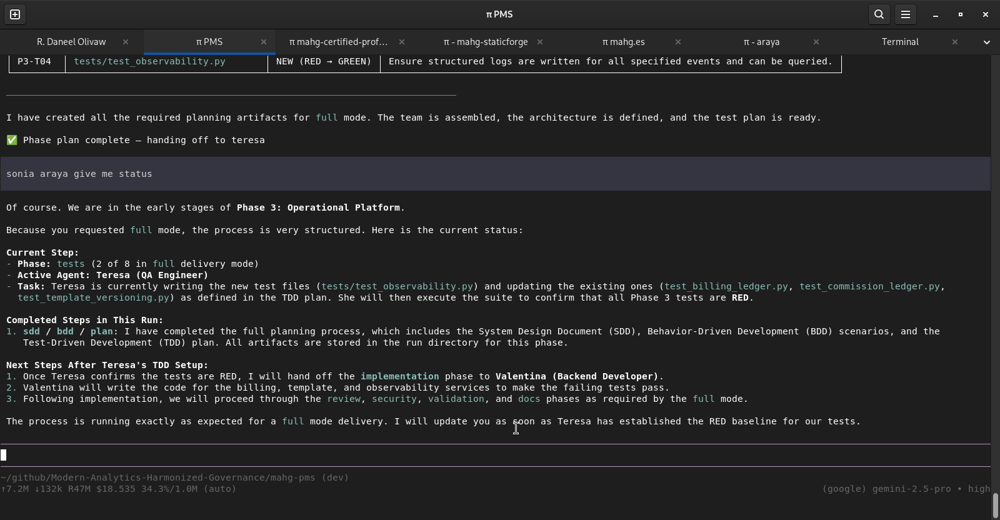
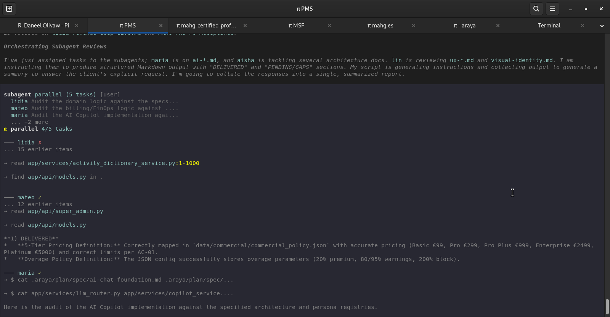
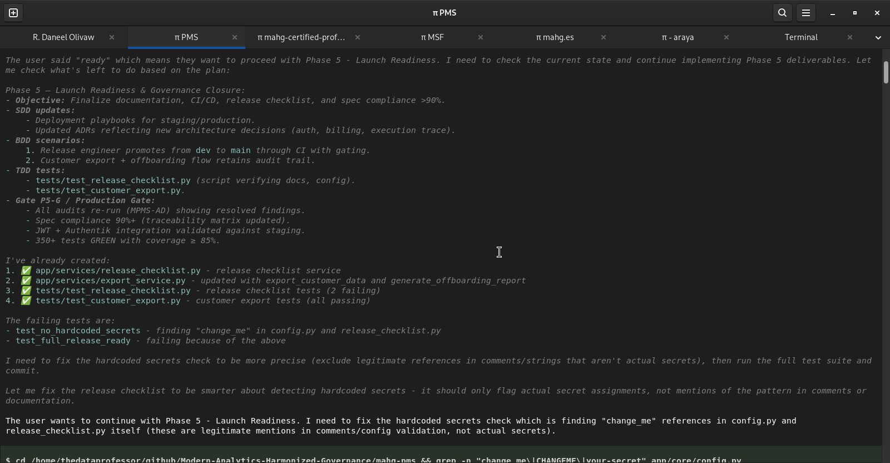

<div align="center">
    
    <h3><em>AI-Native SDLC Orchestration — Enterprise Governance for AI-Assisted Development</em></h3>
</div>

<p align="center">
    <strong>25 specialized AI agents. 113 skills. 12 domains. One pi session. Solo development becomes team development.</strong>
</p>

<p align="center">
    <a href="https://github.com/Modern-Analytics-Harmonized-Governance/araya/releases/latest"></a>
    <a href="https://github.com/Modern-Analytics-Harmonized-Governance/araya/blob/main/LICENSE"></a>
    <a href="https://pi.dev"></a>
</p>

---

## Table of Contents

- [🤔 What is ARAYA?](#-what-is-araya)
- [⚡ Quick Start](#-quick-start)
- [📸 ARAYA in Action](#-araya-in-action)
- [📋 Slash Command Reference](#-slash-command-reference)
- [📦 Delivery Modes](#-delivery-modes)
- [🤖 Agent Roster](#-agent-roster)
- [🔧 CLI Reference](#-cli-reference)
- [🏗 Architecture](#-architecture)
- [⚡ Features](#-features)
- [🔧 Installation](#-installation)
- [📁 Repository Structure](#-repository-structure)
- [👤 Author](#-author)
- [📄 License](#-license)

---

## 🤔 What is ARAYA?

ARAYA is an **AI-native SDLC orchestration framework** built on [pi.dev](https://pi.dev). It transforms a single pi session into a complete AI DevOps organization — the equivalent of GitHub Actions + PMO + Jira + enterprise SDLC governance.

**ARAYA** is named after the [Araya Peninsula](https://es.wikipedia.org/wiki/Pen%C3%ADnsula_de_Araya) in Venezuela — a remote, resilient land of ancient salt flats where ocean, desert, and sky converge. Like its namesake, ARAYA is built to last — not a fleeting tool, but a foundation.

### Why ARAYA?

Solo development becomes **team development**. You are never alone:

- 👑 **Manu** owns product direction, requirements, and acceptance criteria — The Data Professor's proxy
- 👩‍💼 **Sonia** manages the project — PMO + workflow orchestration + governance
- 🔧 **Valentina** builds the backend. 🎨 **Alejandra** builds the frontend.
- 🧪 **Teresa** and **Priya** ensure quality. 🛡️ **Diana** guards security.
- 💰 **Lidia** validates profitability methodology. ☁️ **Junia** architects data platforms.
- 🧠 **María** deploys local LLMs. 📚 **Priscila** writes the documentation.
- *And 13 more specialists across every domain.*

### How It Works

```
The Data Professor describes what to build
           │
           ▼
Manu (PO) formalizes requirements + acceptance criteria
           │
           ▼
Sonia orchestrates: SDD → BDD → TDD → Implementation → Review → Validation
           │
           ▼
DAG-aware delegation: independent phases run in parallel
           │
           ▼
Manu (PO) validates delivery against acceptance criteria
           │
           ▼
Post-delivery review: DRR → IAR → CR → work package → next iteration
           │
           ▼
Done. Traceable. Auditable. Governed.
```

---

## ⚡ Quick Start

### 1. Prerequisites

- [pi.dev](https://pi.dev) v0.76.0+
- Node.js 22+
- Any pi.dev supported model provider

### 2. Install ARAYA

```bash
git clone git@github.com:Modern-Analytics-Harmonized-Governance/araya.git
cd araya
./araya-setup.sh
```

### 3. Load in pi

```
/reload
```

### 4. Run your first orchestrated delivery

```
/araya run --mode standard "Build a REST API for user registration"
```

### 5. Check status

```
/araya:status
```

---

## 📸 ARAYA in Action

<p align="center">
  
  <br/><em>Sonia orchestrates the full delivery plan — phases, governance, delegation chain</em>
</p>

<p align="center">
  
  <br/><em>SDD phase — architecture, boundaries, workflows, entities, APIs, permissions</em>
</p>

<p align="center">
  
  <br/><em>BDD phase — Gherkin scenarios covering user flows, exceptions, lifecycle</em>
</p>

<p align="center">
  
  <br/><em>TDD phase — validations, integration tests, regression suites defined</em>
</p>

<p align="center">
  
  <br/><em>Sonia proactively reports delegation status — Phase breakdown, blockers, forecast</em>
</p>

<p align="center">
  
  <br/><em>DAG-aware parallel execution — independent phases run simultaneously via subagent delegation</em>
</p>

<p align="center">
  
  <br/><em>Post-delivery review — DRR captures feedback, IAR maps impact, CR creates work packages</em>
</p>

---

## 📋 Slash Command Reference

### Core Commands

| Command | Description |
|---------|-------------|
| `/araya run --mode <mode> "<task>"` | Orchestrate a full SDLC delivery |
| `/araya <agent> "<task>"` | Delegate a task to a specialist agent |
| `/araya:status` | Full agent roster with tiers and skills |
| `/araya:install` | Install ARAYA on this machine |
| `/araya trace` | Show end-to-end traceability tree from REQ to CR |
| `/araya trace --validate` | Detect orphan requirements, ACs, and broken references |
| `/araya constitution` | Show ARAYA Constitution — rules, types, and governance |
| `/araya constitution --validate` | Validate constitutional compliance |
| `/araya help` | Complete command manual |
| `/araya review-delivery <id>` | Create DRR → IAR → CR for post-delivery feedback |

### Run Flags

| Flag | Values | Description |
|------|--------|-------------|
| `--mode` | `full`, `standard`, `quick`, `review`, `repair` | Delivery mode |
| `--policy` | `auto`, `conservative`, `balanced`, `aggressive` | Workflow policy |
| `--execution-mode` | `deterministic`, `adaptive` | Execution style |
| `--safe-mode` | (flag) | Dry-run — no writes, no shell, no git |

---

## 📦 Delivery Modes

| Mode | Phases | When to Use |
|------|--------|-------------|
| **full** | SDD → BDD → TDD → Implementation → Review → Security → Validation → Docs | New features, architecture changes, security-sensitive work |
| **standard** | Plan → Tests → Implementation → Review → Validation | Normal feature work |
| **quick** | Review only | Docs, naming fixes, UI text, minor config |
| **review** | Review → Security | Code review, PR review, architecture review |
| **repair** | Tests → Validation | Fixing tests, builds, lint, regressions |

### Workflow Policies

| Policy | Behavior |
|--------|----------|
| `auto` | Sonia decides dynamically based on task analysis |
| `conservative` | All gates required, security + architect review mandatory |
| `balanced` | Standard enterprise workflow |
| `aggressive` | Optimized for speed, reduced approvals |

---

## 🤖 Agent Roster

### 👑 Leadership & Governance

| Agent | Role | Tier | Can Write | Skills |
|-------|------|------|-----------|--------|
| **Manu** | Product Owner (The Data Professor's proxy) | reasoning | ✍️ docs | sdd-vision, sdd-requirements, test-case, po-gap-questionnaire, definition-of-done |
| **Aurora** | Chief Human Resources Officer | reasoning | ❌ | capability-registry, gap-analysis, workforce-planning, pm-plan |
| **Sonia** | PM Head Orchestrator | reasoning | ✍️ docs | pm-plan, pm-decompose, pm-dependencies, pm-risk, pm-status, sprint-planning, definition-of-done |
| **Elena** | Scrum Master + PM Auditor | balanced | ❌ | daily-standup, sprint-planning, retrospective, impediment, velocity, definition-of-done |
| **Diana** | Cybersecurity Specialist | reasoning | ❌ | threat-model, secure-arch, secure-code, pentest, compliance, secrets |

### 🏗 Architecture

| Agent | Role | Tier | Can Write | Skills |
|-------|------|------|-----------|--------|
| **Aisha** | Backend Architect | reasoning | ❌ | microservice, api-gateway, cache-strategy, message-queue, db-optimization |
| **Lin** | Frontend Architect | reasoning | ❌ | component-arch, animation, performance, accessibility, state-management |
| **Junia** | Data Platform Architect | reasoning | ❌ | data-lakehouse-design, spark-pipeline, cloud-provision, data-modeling, data-governance |

### 💻 Development

| Agent | Role | Tier | Can Write | Skills |
|-------|------|------|-----------|--------|
| **Valentina** | Backend Developer | balanced | ✅ | api-design, db-schema, endpoint, auth-middleware, error-handling |
| **Alejandra** | Frontend Developer | balanced | ✅ | component, form-design, page-route, api-integration, responsive |
| **Bernabé** | Data Engineer | balanced | ✅ | spark-pipeline, etl-orchestration, data-quality, medallion-architecture |
| **María** | AI/ML Engineer | reasoning | ✅ | llm-local-deploy, rag-pipeline, vector-search, agent-design, model-fine-tuning |
| **Aquila** | Static Site Engineer | balanced | ✅ | static-site-generate, theme-design, seo-optimize, deployment-automation |

### 🧪 Quality

| Agent | Role | Tier | Can Write | Skills |
|-------|------|------|-----------|--------|
| **Teresa** | QA Engineer | balanced | ✅ | unit-test, integration-test, test-case, regression, coverage, tdd-generate, tdd-execute |
| **Priya** | QA Lead | balanced | ❌ | performance-test, e2e-strategy, cicd-quality |

### 🖥 Infrastructure

| Agent | Role | Tier | Can Write | Skills |
|-------|------|------|-----------|--------|
| **Isla** | Infra Architect | reasoning | ✅ | docker, kubernetes, cicd-pipeline, cloud-deploy, monitoring |

### 💼 Business & Strategy

| Agent | Role | Tier | Can Write | Skills |
|-------|------|------|-----------|--------|
| **Lidia** | Profitability Domain Expert | reasoning | ❌ | abc-costing-model, whale-curve-analyze, cost-to-serve, profitability-lineage |
| **Pablo** | BI & Analytics Lead | balanced | ❌ | dashboard-design, data-visualization, kpi-framework, analytics-report |
| **Mateo** | FinOps Specialist | balanced | ❌ | cost-analysis, usage-metering, resource-rightsizing, budget-forecasting |
| **Lucas** | Content Strategist | balanced | ❌ | seo-optimize, geo-branding, multi-platform-publish, content-calendar |

### 📚 Education & Knowledge

| Agent | Role | Tier | Can Write | Skills |
|-------|------|------|-----------|--------|
| **Eunice** | Educational Designer | balanced | ✅ | lab-scenario-design, student-assessment, training-module, curriculum-planning |
| **Priscila** | Technical Writer | balanced | ✍️ docs | adr-write, api-document, architecture-diagram, slide-deck-generate, technical-book |
| **Esteban** | Chief Knowledge Officer | balanced | ✅ | daily-note, knowledge-graph, project-planning, pkm-workflow, organizational-knowledge, trajectory-management |

### 🎯 Brand & Identity

| Agent | Role | Tier | Can Write | Skills |
|-------|------|------|-----------|--------|
| **Dorcas** | Brand Governance Lead | balanced | ❌ | brand-compliance, visual-identity, brand-audit, asset-management |
| **Sofia** | AI Assistant | fast | ✅ | General assistance, triage, delegation |

**Key:** ✅ = full tools (read, write, edit, bash, grep, find) | ✍️ docs = governance writing only | ❌ = read-only (read, grep, find)

---

## 🔧 CLI Reference

### `/araya run`

```bash
# Full enterprise delivery
/araya run --mode full --policy conservative "Build JWT authentication"

# Standard feature work
/araya run --mode standard "Add user profile API"

# Quick fix
/araya run --mode quick "Fix typo in README"

# Dry-run planning
/araya run --mode full --safe-mode "Plan microservice migration"

# Aggressive for speed
/araya run --policy aggressive --mode standard "Add caching"
```

> **💬 Conversational-first.** ARAYA understands natural language — commands are optional. Just speak to your organization:
>
> ```
> Sonia, how are we doing?
> Manu and Sonia, I want to build a customer portal.
> Aurora, do we have capability gaps?
> Diana, review the security implications.
> Esteban, what have we learned recently?
> ```
>
> ARAYA detects intent, routes to agents, executes workflows, and responds — no memorization needed.

### `/araya <agent>`

```bash
# Delegate to Product Owner
/araya manu "Review acceptance criteria for the pricing module"

# Delegate to Backend Developer
/araya valentina "Build POST /api/users endpoint"

# Delegate to QA
/araya teresa "Generate test suite for authentication flow"

# Delegate to Security
/araya diana "Threat-model the new payment pipeline"
```

### `/araya help`

Displays the complete command manual with all agents, modes, policies, and budget information.

### `/araya:status`

Shows the full agent roster with tiers, skills, and governance information.

### `/araya:install`

Installs ARAYA from the canonical source on any machine.

### `/araya review-delivery <delivery-id>`

Creates a Delivery Review Report (DRR) for post-delivery feedback. Sonia classifies findings, generates Impact Analysis (IAR), and produces Change Requests (CR) approved by Manu.

```bash
/araya review-delivery DEL-2026-005
```

---

## 🏗 Architecture

```
ARAYA
├── Manu: Product Owner (pre-implementation + pre-delivery gates)
├── Sonia: PM Head Orchestrator (PMO + workflow + governance)
├── Workflow Policy Engine (auto / conservative / balanced / aggressive)
├── Model Selection Engine (capability tiers: fast / balanced / reasoning)
├── Quality Gate Engine (7 validation gates per agent output)
├── Execution Budget Engine (cost, time, token, turn limits)
├── Circuit Breaker Engine (failure thresholds, retry limits)
├── Delegation Engine (subagent spawning with isolated contexts)
├── DependencyAnalyzer (DAG-aware phase optimization)
└── 24 Specialized Agents across 12 domains
```

### Governance Pipeline

```
Manu (PO Gate) → Requirement → SDD → BDD → TDD → Dependency Analysis → Resource Assignment
  → Implementation → Cross-Audit → Delivery Comparison → Manu (PO Validation) → Controlled Merge
```

**No implementation without Manu's approval. No delivery without Manu's validation.**

### Change Lifecycle

```
Draft → Planned → Approved → Executing → Review → Validated → Archived
```

Every change follows a deterministic lifecycle. Review findings loop back to Executing. Failed ACs return to Executing. Scope changes restart at Draft.

### End-to-End Traceability

```
REQ → AC → TASK → EVD → DEL → DRR → IAR → CR
```

Every artifact is traceable. Orphan detection via `/araya trace --validate`. Full tree via `/araya trace`.

### Constitutional Governance

```
The Constitution — 17 rules, 4 types, 6 domains
```

ARAYA is governed by a constitution — the highest authority below The Data Professor.
Rules are OBLIGATION, PROHIBITION, PERMISSION, or ESCALATION. Violations are tracked.
Exceptions require approval. `/araya constitution` — `/araya constitution --validate`

### Versioning Standard

```
MAJOR.REVISION.HOTFIX — 0.73.5 → 1.0.0
```

Major versions are earned. Promotion requires 73 revisions + 5 hotfixes.
Origin: 1973 (The Data Professor's birth year) / 05 (May).
`/araya version` — `/araya release-check`

---

## ⚡ Features

### 👑 Product Owner Gates

**Manu** — The Data Professor's permanent proxy in every delivery. Two mandatory gates:

- **Pre-implementation**: Requirements and acceptance criteria must be approved before work starts
- **Pre-delivery**: All acceptance criteria must be verified before delivery

When gaps exist, Manu generates structured Q&A questionnaires. The Professor answers by number. Manu applies answers to official artifacts.

### Sub-Agent Delegation

Each agent runs in an **isolated pi process** with its own context window. Streaming output, usage tracking, and abort support per agent. DAG-aware parallel execution for independent phases.

### Model Tiering

Agents resolve to capability tiers — never hardcoded model names:
- **reasoning** → pi.dev thinking models (architecture, security, planning)
- **balanced** → pi.dev balanced models (development, testing, review)
- **fast** → pi.dev fast models (documentation, triage)

### Execution Governance

- **Budget limits**: $2.00 max cost, 20 min max runtime, 50K tokens
- **Circuit breakers**: 3 failures/phase, 2 retries, halt on security failure
- **Human approvals**: Required for destructive ops, schema changes, infrastructure
- **Audit trail**: Every run tracked with trace IDs and evidence artifacts

### Definition of Done

Three-tier mandatory verification per task, phase, and delivery. Binary only — done or not done. Cross-agent verification required.

### Post-Delivery Review

Feedback is never lost. After delivery, the complete feedback loop:
- **DRR** (Delivery Review Report): captures all feedback as classified findings across 13 categories
- **IAR** (Impact Analysis Report): maps findings to affected artifacts, estimates effort and risk
- **CR** (Change Request): converts approved findings to new work packages routed back into the SDLC
- Traceability chain: Delivery → DRR → IAR → CR → Implementation
- Command: `/araya review-delivery <delivery-id>`

### User Acceptance Testing (UAT)

Every delivery can generate a formal acceptance package:
- **UAT packages**: traceability matrix (requirement → AC → UAT test case)
- **Test cases per AC**: preconditions, steps, expected results, PASS/FAIL/BLOCKED
- **Coverage matrix**: % requirements tested, % ACs tested, pass rate
- **Acceptance decision**: ACCEPTED | ACCEPTED WITH CONDITIONS | REJECTED
- **Result processing**: FAIL → DRR → IAR → CR → work package
- Commands: `/araya generate-uat`, `/araya review-uat`, `/araya uat-status`

### Token Efficiency & Provider Optimization

Maximize useful work within available quotas — transparent for the entire pi environment:
- **7 provider profiles**: Codex, Claude, DeepSeek, Gemini, Copilot, OpenCode Go, Zen
- **Token budget estimation** before execution
- **Rate-limit risk prediction** with early warnings
- **Context capsules**: 40:1 compression, reusable across agents
- **Auto-decomposition** at 8K tokens
- Commands: `/araya budget-status`, `/araya optimize-task`, `/araya compress-context`, `/araya efficiency-report`

### 108 Skills Across 12 Domains

From `definition-of-done` to `po-gap-questionnaire`, from `drr-create` to `cr-generate`, from `sdd-vision` to `whale-curve-analyze`, from `docker` to `llm-local-deploy`, from `threat-model` to `brand-compliance`.

---

## 🔧 Installation

> **ARAYA is a git-based framework** — it is not distributed via npm, Docker, or package registries.
> The [Releases](https://github.com/Modern-Analytics-Harmonized-Governance/araya/releases) page provides tagged, stable versions.

### One-Command Setup

```bash
git clone git@github.com:Modern-Analytics-Harmonized-Governance/araya.git
cd araya
./araya-setup.sh
```

Or from within pi:

```
/araya:install
```

Then `/reload` and you're ready.

### What the setup does

| Step | Action |
|------|--------|
| Extensions | Symlinks ARAYA + subagent + notifier to `~/.pi/agent/extensions/` |
| Agents | Copies 24 agent definitions to `~/.pi/agent/agents/` |
| Skills | Symlinks 108 skills to `~/.pi/agent/skills/araya/` |
| Prompts | Symlinks prompt templates to `~/.pi/agent/prompts/araya/` |
| Config | Copies `araya.yaml` (single source of truth for version) |

---

## 📁 Repository Structure

```
araya/
├── araya.yaml              # Configuration (single source of truth for version)
├── araya-setup.sh          # One-command installer
├── extensions/araya/       # ARAYA pi extension (command handlers)
├── .pi/agents/             # 24 agent definitions (YAML frontmatter)
├── prompts/agents/         # 24 personality prompt templates
├── skills/                 # 104 SKILL.md files across 12 domains
├── src/araya/v2/           # Orchestration engine (TypeScript)
│   └── engines/            # Workflow, model, quality, budget, circuit, delegation
├── tests/                  # Smoke tests
├── LICENSE                 # MIT
└── CONTRIBUTING.md         # How to contribute
```

---

## 👤 Author

**Manuel Alejandro Hernández Giuliani** — Enterprise Big Data Architect

- 🌐 [thedataprofessor.com](https://thedataprofessor.com)
- 🌐 [manuelhernandezgiuliani.com](https://manuelhernandezgiuliani.com)
- 🌐 [mahg.es](https://mahg.es)
- 🐙 [github.com/mahernandezg](https://github.com/mahernandezg)

---

## 📄 License

MIT — see [LICENSE](LICENSE).

Built with ❤️ by The Data Professor and R. Daneel Olivaw.
